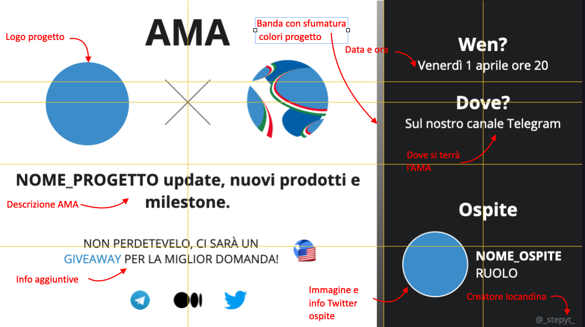

# Template
Questo README contiene le informazioni per costruire le locandine da utilizzare nella pubblicazione social degli AMA.

* ```./assets/```: inserire in questa cartella tutte le immagini utilizzate.
* ```./twitter.key```: contiene il template da utilizzare per promozione su Twitter. Il template è riportato nell'immagine sotto:

le frecce rosse indicano dove modificare il template.